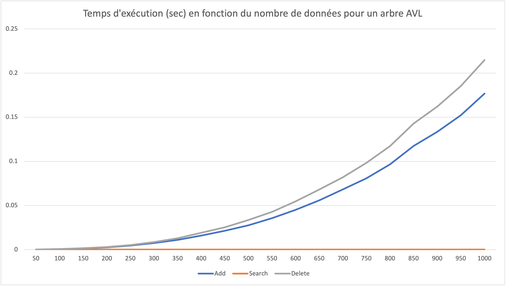
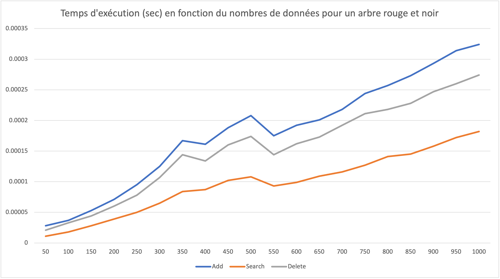
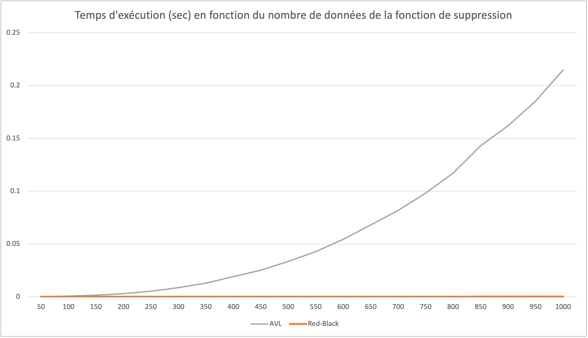
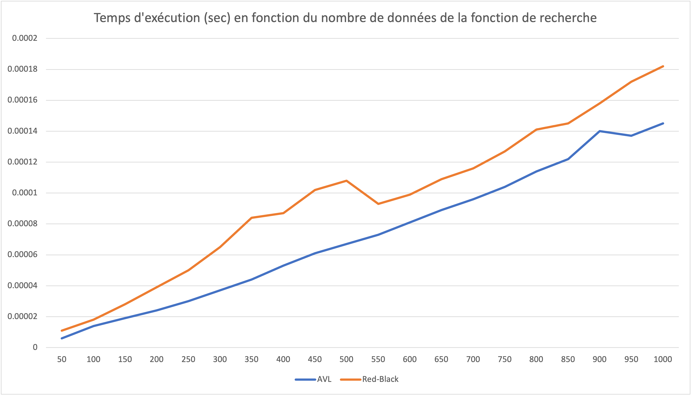
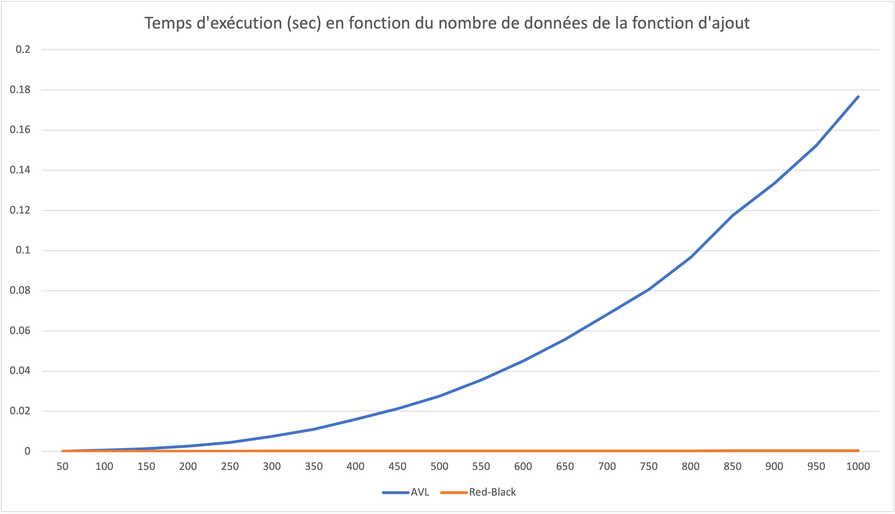

# TEA - Arbre AVL & Arbre Rouge et Noir

[TOC]

## Objectif

Le but de ce projet est d’implémenter les algorithmes sur les arbres équilibrés AVL ainsi que les arbres Rouge et Noir et de comparer leurs performances graphiquement sur des données aléatoires.

## Fonctionnement

### Sentinelle

Dans l'arbre rouge et noir, nous avons mis en place une sentinelle. Puisque toutes les feuilles d'un arbre rouge et noir doivent être noires et ne contenir aucune donnée, cela signifie qu'elles sont toutes identiques. Nous avons donc décidé de mettre en place une sentinelle, un noeud noir vide, que l'on initialise avec l'aide d'une fonction 'initializeSentinel'. Nous avons donc un unique noeud qui représente toutes les feuilles de tous les arbres rouge et noir. Il est donc important de penser à libérer la mémoire de la sentinelle à la fin de son utilisation, avec la fonction 'freeSentinel'.
Allouer qu'une seule fois la mémoire permet d'économiser beaucoup de mémoire, principalement si on a un grand nombres de données.

### Fonction de suppression

Dans l'arbre rouge et noir, pour la fonction de suppression, lorsqu'il y a besoin de rééquilibrer l'arbre (ce qui arrive lorsqu'on supprime un noeud noir et qu'il n'a soit pas de fils, soit un fils noir), certaines actions sont faites en fonction du cas présent comme pour la fonction d'insertion (vu en cours).

## Problèmes rencontrés

### Arbres rouges et noirs

On a rencontré un problème lors de l'implémentation des fonctions d'insertion et de suppression. La compréhension des différents cas à traiter fut complexe, principalement pour la fonction de suppression mais nous avons finalement compris avec l'aide d'un [site](https://www.irif.fr/~carton/Enseignement/Algorithmique/Programmation/RedBlackTree/).

### Libération de mémoire

On a aussi rencontré un problème lors de la libération de la mémoire dans les fonctions de suppressions. Nous avons passé de nombreuses heures à essayer de comprendre pourquoi la libération des données ne se faisait pas bien. Mais nous avons finalement réussi à bien libérer la mémoire.

### Type Couple

Lors des tests, lors de l'utilisation du type Couple, nous avons rencontré un problème que nous n'avons pas réussi à résoudre. Il se trouve qu'une fois sur deux, l'exécution du test fonctionne très bien, et l'autre fois, nous pensons que nous rencontrons une erreur de mémoire, mais pourquoi n'est elle pas présente à chaque exécution ? Un étrange erreur que nous ne comprenons pas vraiment, donc difficile à corriger.

## Graphiques

### Interprétation

On voit sur les graphiques ci-dessous que le temps d'exécution pour les fonctions d'ajout et de suppression d'un arbre AVL augmente très fortement en fonction du nombre de données. En comparaison, celles d'un arbre rouge et noir augmentent légèrement.
Il est donc bien plus intéressant d'utiliser un arbre rouge et noir plutôt qu'un arbre AVL.
Cependant on voit que pour la fonction de recherche, le temps d'exécution pour un arbre rouge et noir est légèrement plus élevé que pour un arbre AVL.
L'utilisation d'un arbre AVL serait donc plus intéressant pour une recherche de données, mais cela ne vient pas contre-balancé la différence pour les fonctions d'ajout et de suppressions.

En conclusion, il est plus intéressant d'utiliser un arbre rouge et noir plutôt qu'un arbre AVL, car la manipulation d'un arbre AVL prendra beaucoup plus de temps que celle d'un arbre rouge et noir.

### Graphiques

